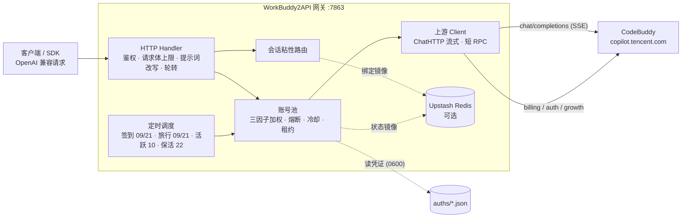

<p align="center">
  
</p>

<h1 align="center">WorkBuddy2API Panel</h1>

<p align="center">
  <b>把腾讯 CodeBuddy 账号变成 OpenAI 兼容 API 的多账号网关 · 附 Web 管理面板</b><br>
  Web 面板 · OAuth 浏览器登录 · 账号池轮转 · 熔断与冷却 · 会话粘性 · 定时签到 / 活跃 / 旅行 / 保活 · <b>成长任务一键完成（17/18）</b> · 流式 / 非流式
</p>

<p align="center">
  
  
  
  
</p>

---

> **本项目是 [Sliverkiss/workbuddy2api](https://github.com/Sliverkiss/workbuddy2api) 的增强分支**（fork）。
> 在上游基础上重构了可视化运维层，并同步了上游全部功能更新。
> 差异概览见 [与上游的差异](#-与上游的差异)；上游设计的精巧之处（账号池调度、错误分类、提示词体系）原样保留，详见下文与上游 README。

## 项目简介

WorkBuddy2API 是一个自托管的 **OpenAI 兼容反向代理网关**，将腾讯 CodeBuddy（`copilot.tencent.com`）账号包装为统一的 `/v1/chat/completions` 服务。

- 官方不提供 OpenAI 形态的开放 API，本项目通过 **OAuth 设备授权**（面板「添加账号」或 `login.sh`）获取账号凭证，在网关侧做 token 自动刷新、账号池调度与流量治理；
- 面向 **个人多账号** 场景：多账号共享、单号故障自动换号、冷却 / 熔断防止雪崩、会话粘性保证多轮上下文不跳号；
- 对客户端只暴露 OpenAI 兼容接口，现有 SDK / 前端 / 工具 **零改造接入**。

> ⚠️ 合规须知：本项目是**非官方**网关，使用 CodeBuddy 账号作为上游，**仅限本人授权账号、本机 / 私有环境测试**。详细边界见[安全与合规](#安全与合规)。

## 核心能力

| 能力 | 说明 |
|---|---|
| 🔑 **OAuth 一键登录** | `login.sh` 设备授权流程，自动落盘凭证并重启容器加载新账号 |
| 🔄 **多账号池** | 三因子加权随机选号（积分占比 ×10 + 闲置补偿 + 成功率 ×3），Top-5 候选 + 防惊群 |
| 🛡️ **熔断与冷却** | 429 软冷却 600s 起指数退避（封顶 `soft_rate_max`）、404 固定 60s 短冷却、402 硬冷却至次日 04:00、连续失败熔断、在途租约限流 |
| 🧲 **会话粘性** | 同一会话（`conversation_id`）尽量绑定同一账号，TTL 滚动续期，失败自动解绑，可镜像 Redis 防重启丢失 |
| ⏰ **定时任务** | 签到（09/21 点，末尾自动跑**连登管家**：兑换已解锁档位 + 抽完抽奖次数）+ 活跃上报（10 点，点亮连登 / 解锁领养 + streak 自检）+ 猫猫旅行（09/21 点，独立排程）+ token 保活（22 点），四类独立开关 |
| ⚡ **流式 + 非流式** | 出站强制 `stream:true`；SSE 帧按规范白名单重建；非流式由本地聚合为单响应 |
| 🧠 **推理模型兼容** | DeepSeek 思维链注入（`thinking.type=enabled` + 默认档）、`reasoning_content` 多轮回填、effort 档位自动降级 |
| 💬 **系统提示词体系** | 网关自有提示词替换客户端 system（默认 `custom`），从源头消灭 system 来源的内容误报；`passthrough` 遇拦截自动降级重试 |
| 🗑️ **指纹脱敏** | 出站请求体黑名单指纹字段清洗（可关闭），与提示词体系两层叠加 |
| 📊 **可观测** | 每请求一行表格日志（TTFB / token 速率 / uid）；`/healthz` 带 `service` 身份标识可接负载均衡 / 宿主探活 |
| 💾 **状态持久化** | 池状态本地原子落盘 + Upstash Redis 异步镜像（可选），重启择新恢复 |
| 🖥️ **Web 管理面板** | 内嵌单页面板（明暗主题），账号运维 / 模型档位查询 / 在线改配置（热生效）/ 运行日志 / 积分任务，见 [Web 管理面板](#-web-管理面板) |

## 🎯 成长任务一键完成（17/18）

官方「成长计划」的 18 个成长任务中，**17 个可在面板上一键纯 API 完成**——无需安装官方客户端、无需人工交互，点一下「一键完成」即自动推进进度、等待异步计分落定并**自动领奖**。剩余任务展示操作指引。

### 任务覆盖与奖励

| 任务 | 奖励 | 一键完成方式 |
|---|---|---|
| `first_buddy` | +300c +8e | 解锁上报 → 同意协议 → 领养第一只 Buddy |
| `create_canvas` | +300c +5e | 设计画布创建事件组（Ardot 遥测） |
| `chat_5` | +100c | 对话活跃上报 ×5（自动补足差额） |
| `Model_chat_GLM5.2` | +100c +5e | glm-5.2 真实对话一次（发一条短消息） |
| `RichMeow_Chat` | +100c +5e +UR Buddy | 桌面端对话事件链（6 事件，含成功回执） |
| `Buddy_App` | +100c +5e | Buddy 应用「发现→进入→授权」事件链 |
| `Buddy_App_QQ` | +50c +5e | 企鹅教师助手进入事件链（与上一条共用） |
| `automation_1` | +100c +5e | 定时任务创建成功事件 |
| `Library_read` | +100c +5e | 资料库阅读点击（web 域上报） |
| `template_5` | +100c +5e | 模板使用事件组 ×5 |
| `playbook_prompt` | +100c +5e | 灵感案例「做同款」发送事件 |
| `expert_5` | +100c +5e | 真实专家召唤+使用链 ×5（专家市场拉真实专家 → 真实对话 → 使用事件） |
| `Expert_team_use_3` | +100c +5e | 专家团召唤+使用链 ×3 |
| `Hp_Appearance` | +100c +5e | 主题设置 + 皮肤生效事件 |
| `Expert_lighthouse` | +100c +5e | 轻量云专家召唤+使用链（真实对话 requestId，**可免费领一个月轻量服务器**） |
| `skill_1` | +100c +5e | 真实对话 + 技能加载事件（skill_info） |

**全新账号一键全做完 ≈ +1950 credits +78 能量**，其中仅数个任务涉及真实对话（`Model_chat_GLM5.2` 一条、`expert_5`/`Expert_team_use_3`/`skill_1` 各数条 fast-model 短对话），其余全部为行为事件上报，零对话消耗。

### 不可自动的 1 个

| 任务 | 原因 |
|---|---|
| `Expert_Philanthropy` | 需真实捐款（服务端领奖时校验捐赠回执，已实测无法绕过） |

### 实现原理（简述）

任务计分走 `/v2/report` 行为上报，但**不同任务认不同客户端指纹**：CLI 指纹（`www.codebuddy.cn`）、桌面指纹（`copilot.tencent.com` + `WorkBuddy/5.5.6` UA + `workbuddy-desktop` 事件族）、web 指纹（`www.workbuddy.cn` + `x-client-platform: web`）。网关为每类任务构造对应指纹的判据事件链（`internal/upstream/desktop.go`）；专家类任务额外要求真实专家 id 与真实对话回执（`internal/upstream/streak.go` 之外的 expert 序列）。上报 200 ≠ 计分——面板在执行后轮询任务进度，达标即自动调用 Web 域领奖接口。

> ⚠️ 行为事件按天幂等：重复点「一键完成」不会重复扣资源，已达标的任务自动跳过。

### 🧭 任务中心（面板新视图）

「任务中心」视图把散落的任务能力收拢成一处：

- **全账号任务扫描**：一键拉取每个账号的成长任务（未完成且可自动化的 17 项）+ 开学季待办，列表一目了然
- **执行队列**：把待办按账号排队执行——账号内串行（与单任务/一键完成共用互斥锁），账号间可选并发（1-3）；执行进度实时更新到每个条目
- **开学季独立状态卡**：每账号 5 任务（分享/桌面/对话×3/专家/学生认证）的状态矩阵 + 剩余抽奖次数，一键触发全账号闭环
- **日志分频道**：运行日志按「任务 / 对话 / 系统」三个频道筛选——对话流量再大，任务结果也不会被冲掉；日志条目带频道徽标与时间

### 🎒 开学季活动（5/5 全自动，活动期至 2026-09-24）

官方「AI 好 Buddy，开学有好礼」小程序活动的 5 个任务**全部纯 API 自动完成**（挂签到排程末尾，幂等）：

| 任务 | 奖励（每日） | 判据（已逆向） |
|---|---|---|
| 分享活动 | +100c +1抽奖 | `share-complete` 直调即点亮 |
| 桌面端体验（单次） | +100c +1抽奖 | viewed 激活 + 真实 chat + 桌面六事件链 |
| 和 AI 对话 3 次 | +50c +1抽奖 | viewed 后 3 条 `chat_request_send` 埋点（无需真实会话） |
| 召唤开学季专家 | +50c +1抽奖 | viewed 后 mp 事件链（召唤×3 + 对话） |
| 学生认证 | +100c | 需微信学生真实认证，不做 |

抽奖次数自动全部抽完。期间逆向成果（cf-connect 加密通道、mp 云对话全链路）记录在 `data/desktop-task-protocol.md` §8。

### 连登兑换与抽奖（自动）

成长中心连登档位（连续登录 7/14/28 天）兑换后发放积分 / 能量 / 补签卡 / **抽奖次数**，抽奖次数只能从兑换获得。网关把它挂在每日签到排程末尾自动跑闭环（见[定时任务](#定时任务)）：档位解锁当天自动兑换、有抽奖次数自动抽完，全程无需人工盯。

## 🆚 与上游的差异

本分支相对 [上游 master](https://github.com/Sliverkiss/workbuddy2api) 的增量（均已在真实多账号环境验证）：

### 新增

| 能力 | 说明 |
|---|---|
| **Web 管理面板** | `internal/panel`，前端 go:embed 单文件进二进制，零外部依赖。账号池可视化（健康色条 / 积分量条 / 冷却倒计时）、单号运维、批量任务、日志查看、明暗主题 |
| **浏览器内 OAuth 添加账号** | 面板「添加账号」按钮完成设备授权 → 凭证落盘 → **热加载进池（免重启）**，替代命令行 `login.sh` 流程 |
| **在线配置编辑（热生效）** | 面板直接改 `config.json`：API 密钥 / `soft_rate` / 脱敏开关 / 池参数 / 任务排程**立即生效**；装配期字段（listen 等）保存后提示需重启。写入采用深合并 + 原子替换，保留未知键 |
| **积分任务体系** | 任务列表 / 接受 / 领取接口 + 面板弹窗；「一键完成」覆盖 **17 个任务**（对话 / 领养 / 桌面行为链 / 模板 / 灵感案例 / 画布 / 专家召唤 / 技能尝鲜 / 主题 / 资料库 / 夜猫子等），推进进度、等待异步计分落定后**自动领奖**，纯 API 零客户端依赖 |
| **首启自动生成配置** | 目录下无 `config.json` 时自动生成推荐配置（含 `crypto/rand` 随机 `api_key`），双击即开 |
| **粘性会话内容回退** | 客户端不发 `conversation_id` 时，用 `system + 首条 user` 哈希派生会话键（`d-` 前缀），通用 OpenAI 客户端也能享受粘性 |
| **余额后台刷新** | `schedule.balance_refresh_minutes`（默认 5）周期查余额并更新池，冷却账号余额恢复自动解冻 |
| **模型能力透出** | `/v1/models` 附带 `supported_efforts` / `default_effort` / 积分倍率 / 输入输出上限等上游真实字段 |
| **安全加固** | 常量时间密钥比较（`internal/httpauth`）、CSP 与安全响应头、UID 白名单防路径穿越、前端属性转义修复 |
| **领养前置修复** | 上游 `travelAdopt` 缺 report 前置导致领养恒失败于 `first_buddy task not completed yet`；本分支修正后实测 +300 到账（3/3 账号） |

### 同步上游

**第一轮（fork 基线 `53ee3a1` → `9a87758`，34 个提交）**：四类任务独立排程、pool 文件拆分、12153 连续计数才禁用、429 `code=6004` 模型级限流收窄、11101 不罚号、请求体 413、DeepSeek 思维链、reasoning_content 回填、Codex 指纹脱敏、系统提示词体系、出站 UA 可配等。

**第二轮（`9a87758` → `ea8b1e5`，2026-09-14，只吸收底层）**：

| 上游改动 | 吸收内容 |
|---|---|
| 净化增强 | `tool_calls.arguments` 盲区修复（content=null 的工具调用轮此前完全漏净化）、裸 `11128` 反探测改写、桌面版身份句（逗号形态）漏网修复、反馈句整句改写 |
| 出站头族 | UA 对齐官方三段式 `WorkBuddy/<ver> WorkBuddy/<ver> CLI/<ver>`（默认 5.5.4/2.137.1，可配）；`X-IDE-*` 用量归属四头 + `X-Agent-Purpose`（`client_name` 配 `WorkBuddy` 即对齐官方桌面端）；`X-Device-Token` 设备风控头（auth 每号 / config / 文件三源）；`X-IDE-Version` 补齐 |
| 并发修复 | 客户端 IP 改按请求参数传递（消除共享字段竞态）；billing 单段 UA 形态 |
| 签到幂等 | `IsAlreadyCheckin` 识别"今天已签到"（code=10001/14001），调度日志不再把重复签到当失败 |
| 粘性按模型判活 | 会话绑定的账号被 6004 模型级限额后，换模型请求自动解绑重分配（治"限额后换不动号"）；`/healthz` 探活计入模型豁免形态（治"全号被单模型限流探活误报 503"） |
| report 增强 | `ReportChatActivity` 支持独立 `requestID`（同会话多轮上报各条可区分） |

未吸收（明确不做）：脚本体系（task_runner/school 脚本—我们已有更完整的纯 API 实现）、governance/CI workflow、成本账本选号（依赖 usage.credit 观测，收益待验证）。

### 未做 / 待办

| 状态 | 事项 | 说明 |
|---|---|---|
| ✅ 已修复 | ~~single 类任务奖励领取~~ | **领奖已打通**：正确端点是 Web 域 `POST https://www.workbuddy.cn/activity/growth/tasks/<task_code>/claim`（任务码在路径、无 body、`x-client-platform: web`）。此前误用 CLI 域 `copilot.tencent.com/v2/.../reward/claim` 导致长期 400。「一键完成」现已**达标即自动领奖**（含异步计分等待），面板也可手动领取。实测 +100 分 +5 能到账、重复领取幂等 |
| ✅ 已破解 | ~~桌面端 / 交互类任务~~ | 通过客户端指纹逆向（`/v2/report` 三通道 + 判据事件载荷），**17/18 任务可纯 API 一键完成**：`RichMeow_Chat`（桌面 6 事件链）、`Buddy_App(_QQ)`、`automation_1`、`Library_read`、`template_5`、`playbook_prompt`、`create_canvas`、`expert_5`、`Expert_team_use_3`、`Expert_lighthouse`、`Hp_Appearance`、`skill_1`、`black_cat`（夜间窗口自动补足）等，多账号实测点亮 |
| ⚠️ 不支持 | **剩余 1 个任务** | `Expert_Philanthropy`（需真实捐款：服务端领奖时校验捐赠回执，已实测无法绕过）；面板展示指引 |
| ❌ 未做 | **面板侧 Upstash / 凭证目录配置** | 涉及启动期装配，需手工编辑 `config.json`（面板会提示为重启项） |
| ❌ 未做 | **HTTPS / 内置限流** | 设计上交给反向代理（Nginx / Caddy）。服务本身只提供明文 HTTP，公网部署**必须**置于 HTTPS 反代之后 |

## 架构总览



上游请求在出站前经历统一的改写管线（`internal/upstream/payload.go`）：强制 `stream:true`、`developer` 角色归一、tool_choice 归一、DeepSeek 思维链注入、`reasoning_effort` 档位降级、`reasoning_content` 回填、指纹脱敏。

## 快速开始

### 环境要求

- **Docker + Docker Compose**（服务端部署方式，镜像内已含低权限用户与全部工具脚本）——或
- **Windows / macOS / Linux 直接跑单文件二进制**（无需 Docker，见下方「Windows 单文件运行」）
- 一个或多个已注册的 CodeBuddy 账号，用于 OAuth 登录
- 宿主机 Go ≥ 1.22（仅从源码构建时需要）

### 方式一：Docker Compose（推荐服务器部署）

```bash
# 1. 克隆
git clone https://github.com/linguo2625469/workbuddy2api-panel.git
cd workbuddy2api-panel

# 2. 准备配置（compose 挂载此文件，缺失会导致容器启动失败）
cp config.example.json config.json
#    建议编辑 config.json 设置 api_key（或留空由程序自动生成随机密钥）

# 3. 启动（首次会构建镜像，约 1-2 分钟）
docker compose up -d --build

# 4. 健康检查（无可用账号时返回 503）
curl -s http://localhost:7863/healthz
# {"healthy":0,"total":0,"service":"workbuddy2api"}
```

启动后打开 **`http://localhost:7863/panel/`**，用面板「添加账号」完成登录（见下节）。

常用运维命令：

```bash
docker compose logs -f          # 跟踪日志
docker compose restart          # 重启
docker compose down             # 停止并移除容器（数据在 ./auths 与 ./data，不受影响）
```

### 方式二：Windows 单文件运行（无需 Docker）

```powershell
# 1) 下载 Release 中的 wb2api.exe，或从源码构建
go build -trimpath -ldflags="-s -w" -o wb2api.exe ./cmd/server

# 2) 直接运行：首次启动自动生成 config.json（含随机 api_key，日志打印一次）
.\wb2api.exe -config config.json

# 3) 浏览器打开面板添加账号
#    http://127.0.0.1:7863/panel/
```

exe 为**单文件自包含**（前端资源已 embed 进二进制），拷到任意 Windows 机器即可运行，只需保证 `auths/`（凭证）与 `data/`（状态）目录可写。

### 方式三：源码运行（开发调试）

```bash
go build ./...
go vet ./...
go test ./...                      # 完整测试套件
go run ./cmd/server -config config.json
```

构建全部二进制：

```bash
CGO_ENABLED=0 go build -trimpath -ldflags="-s -w" -o wb2api ./cmd/server
CGO_ENABLED=0 go build -trimpath -ldflags="-s -w" -o signin_bin ./cmd/signin
CGO_ENABLED=0 go build -trimpath -ldflags="-s -w" -o login ./cmd/login
CGO_ENABLED=0 go build -trimpath -ldflags="-s -w" -o credit ./cmd/credit
```

### 添加账号（登录）

**方式 A：Web 面板（推荐，各平台通用，免命令行）**

打开 `http://127.0.0.1:7863/panel/`，点右上角「**添加账号**」：面板展示授权链接 → 浏览器完成登录 → 自动检测并落盘凭证 → **热加载进池（无需重启）**，顺带完成首次签到。

**方式 B：命令行脚本（仅 Linux / macOS，依赖 bash + python3）**

```bash
./login.sh
# 按提示在浏览器打开授权链接 → 回到终端确认 → 凭证落盘 auths/workbuddy-<uid>.json
```

`login.sh` 内置授权 URL 获取 + 浏览器登录 + token 轮询 + 首次签到 + 凭证落盘 + 容器重启，全程无 PKCE（state 由服务端签发）。账号池在容器启动时用 `auths/` 目录自动对齐，新增凭证文件即自动发现。

> Windows 用户请用方式 A（或 WSL）；`login.sh` 需要 python3。

### 验证

```bash
# 模型列表
curl -s http://localhost:7863/v1/models -H "Authorization: Bearer your-api-key"

# 账号状态（汇总 + 每账号详情，disabled 账号透出 disabled_reason）
curl -s http://localhost:7863/status -H "Authorization: Bearer your-api-key"

# 流式聊天
curl -sN http://localhost:7863/v1/chat/completions \
  -H "Authorization: Bearer your-api-key" \
  -H "Content-Type: application/json" \
  -d '{"model":"deepseek-v4-flash","messages":[{"role":"user","content":"hi"}],"stream":true}'

# 非流式聊天（本地聚合）
curl -s http://localhost:7863/v1/chat/completions \
  -H "Authorization: Bearer your-api-key" \
  -H "Content-Type: application/json" \
  -d '{"model":"deepseek-v4-flash","messages":[{"role":"user","content":"hi"}],"stream":false}'
```

## 配置说明

**`config.example.json` 是配置项最完整的参考**：每个字段、默认值与结构都能在其中找到，示例值一律是 `test_key` 之类占位符，**不含任何真实密钥**。下表为字段含义速查。

### 字段速查

| 字段 | 默认 | 说明 |
|---|---|---|
| `listen` | `:7863` | HTTP 监听地址 |
| `api_key` | 空 | 网关鉴权密钥；**空 = 不鉴权直接放行**（公网必须设置） |
| `auth_dir` | `./auths` | 账号凭证目录 |
| `state_file` | `./data/state.json` | 账号池状态持久化文件 |
| `server.max_body_mb` | `8` | 聊天请求体大小上限（MB，0 / 负数启动报错）。超限直接返回 **413 `request_body_too_large`**，不再把半截请求喂给上游。**面板在线修改即时生效** |
| `cooldown.soft_rate` | `600s` | 软限流（429 / 限流文案）冷却基数；同一账号连续触发按 2 倍指数退避 |
| `cooldown.soft_rate_max` | `2h` | 软冷却指数退避封顶 |
| `schedule.checkin_hours` | `[9, 21]` | 每日本地时区整点签到 + 余额查询解冻。空数组 / `null` = 未配置回落默认（不是禁用） |
| `schedule.travel_hours` | `[9, 21]` | 每日本地时区整点推进猫猫旅行状态机（领养 / 派出 / 领奖） |
| `schedule.activity_hours` | `[10]` | 每日本地时区整点对话活跃上报（点亮连登 + 解锁 `first_buddy`） |
| `schedule.keepalive_hours` | `[22]` | 每日本地时区整点刷新 token 保活 |
| `schedule.blackcat_hours` | `[23]` | 每日本地时区整点夜猫子补足（23:00–08:00 计数窗口） |
| `schedule.checkin_enabled` | `true` | 签到总开关；`false` 真正关闭 |
| `schedule.travel_enabled` | `true` | 猫猫旅行总开关（独立于签到） |
| `schedule.activity_enabled` | `true` | 活跃上报总开关 |
| `schedule.keepalive_enabled` | `true` | token 保活总开关 |
| `schedule.blackcat_enabled` | `true` | 夜猫子总开关 |
| `upstream.timeout_seconds` | `120` | 短 RPC（刷新 / 签到 / 余额 / 模型列表）总时长上限 |
| `upstream.header_timeout_seconds` | 回落 `timeout_seconds` | 聊天首字节前（响应头）上限 |
| `upstream.idle_timeout_seconds` | `300` | 聊天流中空闲上限（活跃续命，静默断流） |
| `upstream.user_agent` | 空 | 出站 User-Agent 覆盖（空 = 现状 `CLI/2.63.2 CodeBuddy/2.63.2`）。官网「使用端」列按出站 UA 服务端归因；官方 WorkBuddy 桌面 UA 为 `WorkBuddy/<version>`，需要时可配 |
| `features.sanitize_blacklist_fingerprints` | `true` | 出站请求体黑名单指纹脱敏 |
| `prompt.mode` | `custom` | 系统提示词模式：`custom` = 网关用自有提示词替换客户端 system；`passthrough` = 透传客户端原始 system（降级重试仍切中性提示词） |
| `prompt.file` | 空 | 提示词文件路径；空 = 内置默认（约 2KB）；路径非空但不可读 → 启动报错 |
| `upstash.url` / `upstash.token` | 空 | 空 = 纯内存模式（Noop 降级，功能照常） |
| `pool.max_in_flight` | `3` | 单账号最大在途请求数（`0` = 不限） |
| `pool.max_in_flight_global` | `2` | global 域单账号在途上限（国际版 WAF 风控更紧，压低并发） |
| `pool.degrade_threshold` | `5` | 连败降权阈值：未知错误（ErrClient/传输层）连败 N 次临时出池 |
| `pool.degrade_cooldown` / `pool.degrade_cooldown_max` | `10m` / `2h` | 连败降权时长与封顶 |
| `pool.breaker_threshold` | `3` | 连续失败触发熔断阈值 |
| `pool.breaker_cooldown` | `30m` | 熔断基础退避时长 |
| `pool.breaker_cooldown_max` | `6h` | 熔断指数退避封顶 |
| `pool.idle_weight_per_hour` | `0.5` | 闲置补偿：每小时未使用 +0.5 权重 |
| `pool.idle_weight_max` | `5.0` | 闲置补偿权重封顶 |
| `session_sticky.enabled` | `true` | 会话粘性路由开关 |
| `session_sticky.ttl` | `30m` | 会话绑定 TTL（滚动续期） |
| `session_sticky.gc_interval` | `5m` | 过期绑定 GC 周期 |

### 上游超时语义（三段各归其位）

| 字段 | 作用对象 | 默认 | 行为 |
|---|---|---|---|
| `timeout_seconds` | 短 RPC（token 刷新 / 签到 / 余额 / 模型列表） | `120` | 总时长硬上限，到期报错走换号 / 熔断 |
| `header_timeout_seconds` | 聊天 SSE **首字节前** | `120` | 由 `Transport.ResponseHeaderTimeout` 约束；超时 = 换号重发 |
| `idle_timeout_seconds` | 聊天 SSE **流中空闲** | `300` | 活跃吐数据续命不掐；静默超时才断流释放租约 |

聊天流（`stream` true / false 均同）**没有总时长上限**：聊天使用 `Timeout=0` 的专用 client，长思考 / 长输出不会被掐断。

### 环境变量覆盖

加载顺序：JSON 文件 → `WB2A_*` 环境变量（变量非空才覆盖）：

`WB2A_LISTEN` · `WB2A_API_KEY` · `WB2A_AUTH_DIR` · `WB2A_STATE_FILE` · `WB2A_MAX_BODY_MB` · `WB2A_SOFT_RATE`(duration) · `WB2A_SOFT_RATE_MAX`(duration) · `WB2A_TIMEOUT_SECONDS` · `WB2A_HEADER_TIMEOUT_SECONDS` · `WB2A_IDLE_TIMEOUT_SECONDS` · `WB2A_USER_AGENT` · `WB2A_SANITIZE_FINGERPRINTS`(bool) · `WB2A_PROMPT_MODE` · `WB2A_PROMPT_FILE`

## 核心行为语义

### 系统提示词体系

客户端（Claude Code / Codex 等 CLI）会在 system prompt 注入固定模板句，上游内容审核按**逐字精确匹配**误杀合法流量（HTTP 400 + 审核文案）。网关提供两层防护，互不替代：

1. **提示词体系**（解决 **system / developer 来源**的误报）：由 `prompt.mode` 控制
2. **指纹脱敏**（兜底 **用户 / assistant 消息**里的指纹串）：由 `features.sanitize_blacklist_fingerprints` 控制

| 模式 | 语义 |
|---|---|
| `custom`（默认） | 出站前用网关自有提示词**替换**客户端 system / developer 消息（删除全部 system / developer，头部插入单条 system）；user / assistant / tool 消息逐字不动 |
| `passthrough` | 透传客户端原始 system，不做改写 |

内置默认提示词约 2KB（`internal/prompt/defaultprompt.md`，嵌入二进制）。`prompt.file` 指向自定义提示词文件（自定义人格 / 人设）即整体替换内置默认；**留空 = 内置默认**，路径非空但不可读 → **启动报错**（fail fast，不会静默回落到内置默认）。

### 内容拦截误报与降级重试

`passthrough` 模式请求被上游内容策略拦截（HTTP 400 + `blocked by security policy` / `unapproved channel` / `illegal api invocation` 文案）时，判定为 system 指纹误报：**同请求内**换 Degraded 中性提示词重试一次；第二次仍被拦（用户内容本身触发审核）→ 走既有错误路径返回客户端，并如实报给调用方。

- 触发降级后持续到**次日 00:00 CST**（Asia/Shanghai）重置；降级期内 `passthrough` 请求直达中性提示词，不再先撞 400
- 降级状态是**进程内存态**，重启清零
- 内容问题非账号问题：`ErrContentBlocked` 不罚账号（无冷却 / 熔断 / 计错），由网关降级重试消化

### 错误分类与账号处置

上游错误由 `Classify` 统一分类（判定优先级：余额耗尽 → session 失效 → 限流文案 → 状态码兜底），账号处置如下：

| 分类 | 触发条件 | 账号处置 | 恢复 |
|---|---|---|---|
| 余额不足 | HTTP 402 / body 含余额关键词 | 硬冷却到**次日 04:00**（本地时区） | 签到（09/21 点）余额恢复自动解冻 |
| 频控 | HTTP 429 / 限流文案（不限状态码） | 软冷却 `soft_rate`（600s 起，连续触发指数退避，封顶 `soft_rate_max`）。**`code 6004`（模型级）带「将在 … 重置」时**冷却到上游重置墙钟并豁免切模型（见[常见问题](#429-code6004模型级限流的冷却语义)） | 到期自动恢复 / 成功清零退避 |
| Session 失效 | body 含 `Offline user session not found` / `12153` | **连续 3 次**才永久禁用（一次 12153 多为临时抖动：网络 / 闪断 / refresh 竞态）；刷新成功 / 任意成功 / 手工复活清计数 | 人工重新登录（`login.sh`）或 `ReviveDisabled` 复活 |
| 上游 404 | HTTP 404 | 软冷却固定 60s（不随 `soft_rate`、不单独退避） | 到期自动恢复 |
| 服务端错误 | HTTP ≥500 | 喂连续失败计数，达阈值熔断 | 熔断到期 / 成功清零 |
| 请求体解析失败 | HTTP 400 + `Unmarshal chat params failed` / code `11101` | **不罚账号，但仍轮转**（客户端畸形 JSON，换号照样 400） | 即时 |
| 内容拦截 | HTTP 400 + 审核文案 | **不罚账号**，`passthrough` 模式走降级重试 | 即时 |
| 客户端错误 | 其余 4xx / 业务 `code≠0` | 不处罚，换号重试 | 即时 |

请求体解析失败（`11101`）与内容拦截一样**不罚账号**：问题在请求内容而非账号健康。请求体的网关侧截断已由 `server.max_body_mb` 的 413 消灭，剩余的 `11101` 只可能是客户端发来的畸形 JSON。

**熔断器**：所有冷却入口与 5xx 共用唯一连续失败计数器 `fails`；累计达 `breaker_threshold`（默认 3）触发熔断，退避 `breaker_cooldown × 2^retryCount`，封顶 `6h`；成功清零。

**软冷却指数退避**（与熔断器并存的第二条升级线）：软限流的**冷却时长**本身也按连续次数退避——同一账号连续触发软冷却时 `soft_rate × 2^(连续次数-1)`，封顶 `soft_rate_max`。计数 `soft_streak` 独立于熔断器的 `fails`，只在**成功**或**签到解冻**时清零，随 `state.json` 持久化。

### 选号策略

1. 过滤：禁用 / 冷却 / 熔断 / 在途占满账号不参与
2. 取 **Top-5** 候选（按三因子权重降序，积分只是因子之一）
3. 三因子加权随机：

   `weight = credits 比例 ×10 + idleWeight + successRate ×3`

   - `credits 比例` = 该号积分 / 候选集最大积分
   - `idleWeight` = `min(闲置小时 × idle_weight_per_hour, idle_weight_max)`，从未使用给满分
   - `successRate` = `successCount/(successCount+errTotal)`，无记录给中性 1.5
4. 防惊群：跳过 100ms 内刚被选中的账号；全冷却时从非禁用、非余额耗尽的软冷却 / 熔断账号中选最早到期者顶班

### 会话粘性

同一会话尽量复用同一账号，多轮对话不跳号：

- 会话键提取顺序：`metadata.conversation_id` → `metadata.conversationId` → `metadata.user_id` → 顶层 `conversation_id` → 顶层 `conversationId`（snake_case 优先于 camelCase）
- TTL 滚动续期（默认 30m），GC 周期 5m；绑定可镜像到 Redis（7 天 TTL）防重启丢失
- 请求失败自动解绑；成功后绑定跟随最终成功账号

### 定时任务

五类任务各自独立排程、各有开关，互不影响。容器时区由 `TZ` 控制（compose 默认 `Asia/Shanghai`）。

| 任务 | 开关（默认 true） | 时刻（默认） | 行为 |
|---|---|---|---|
| 签到 | `schedule.checkin_enabled` | `checkin_hours` `[9, 21]` 整点 | 签到 + 余额查询；余额恢复则解冻冷却账号。**末尾追加连登管家**（见下） |
| 活跃上报 | `schedule.activity_enabled` | `activity_hours` `[10]` 整点 | 对话活跃上报（`chat_request_send` 事件，必须含 `userId`）；点亮连登 + 解锁 `first_buddy`；每号每天 1 次 |
| 猫猫旅行 | `schedule.travel_enabled` | `travel_hours` `[9, 21]` 整点 | 独立排程：无猫领养 / `idle` 派出 / `arrived` 领奖 |
| 保活 | `schedule.keepalive_enabled` | `keepalive_hours` `[22]` 整点 | 全账号刷新 token；session 失效**连续 3 次**才自动禁用 |
| 夜猫子 | `schedule.blackcat_enabled` | `blackcat_hours` `[23]` 整点 | **先查任务进度再决定**：`black_cat` 未达标才在 23:00–08:00 计数窗口内补足 glm-5.2 短对话（每天 1 次累计 3 天，漏跑次日窗口自动补） |

#### 连登管家（签到排程末尾自动执行）

成长中心的连登档位（连续登录 7/14/28 天）兑换后发放积分 / 能量 / 补签卡 / **抽奖次数**，抽奖次数只能从兑换获得。管家在每日签到后自动跑一遍闭环（幂等，未解锁静默跳过）：

1. 查连登档位状态 → 已解锁（非 locked / 非 claimed）的档位自动**兑换**
2. 查抽奖次数 → **有次数自动全部抽完**，奖品记日志（`streak-bonus <uid>: 🎲 …`）

无需配置，跟随签到排程；到天数那天自动完成「兑换 → 抽奖」，无需人工盯。

**关闭定时任务**：用 `schedule.*_enabled: false` 显式关闭（四个都设 `false` 则调度器不空转，直接阻塞等待退出信号）。注意两点语义：

- **空数组与 `null` 表示「未配置 → 回落默认」**，不是「禁用」；真正关闭请用 `*_enabled: false`
- **禁用不会擦除小时配置**：`*_hours` 原样保留，改回 `true` 即恢复原时点；小时值必须是 0-23，非法值启动即报错
- 关签到会把「余额恢复即解冻」一起关掉，被硬冷却的账号只能等次日 04:00 自然到期

#### 活跃上报（独立排程）

对池内每个可用账号在 `activity_hours`（默认 `[10]` 整点）发送一条对话活跃上报（事件 `chat_request_send`，body 为数组，事件必须含 `userId`）：

- 一条上报同时点亮 growth 连登 + 解锁 `first_buddy` 任务（领养前置）
- 每号每天 1 次即可（单时点）：日活跃奖励按天去重，重复上报无额外收益
- `conversationId` 由网关生成（`wb2api-<ms>`），无需真实会话
- 限速：账号间间隔 800ms（与旅行同口径）
- **streak 自检**：上报成功后回读连登天数（只读 oracle），日志每号一行可 grep：`activity <uid>: streak days=N`。`days=0` 记 **warn**（`report OK but streak.days=0 (silent drop?)`，对应上游「200 但静默丢弃」）；回读失败记 warn 但不影响主流程（上报按天幂等，不重试，只观测）
- 手动诊断 / 补跑用 `python3 scripts/probe_active.py`（只读探测；写操作默认 dry-run，需 `--yes`）

#### 猫猫旅行（独立排程）

对池内每个可用账号在 `travel_hours`（默认 `[9, 21]` 整点）单趟推进一次，每趟只做一个动作，不轮询不等待。默认两趟闭环：9 点领昨日到站奖励并派出，21 点领当日到站奖励（`daily_limit_reached` 自动挡住二次派出）。

| 探测结果 | 动作 |
|---|---|
| 无猫（`buddy` 为 `null`） | 先同意协议（幂等），再尝试领养；过门槛则 +300 积分并获得猫 |
| `state=idle` 且今日未派出 | 派出 `location_id=4`（古镇客栈；4 个地点收益 / 时长区间相同，无最优解） |
| `state=arrived` | 领取到站奖励（带 `record_id`） |
| `state=traveling` / 今日已达上限 / 未知状态 | 跳过 |

- 领养门槛未达标时上游返回 HTTP 400，每账号每自然日只尝试一次（跨日重试，记录仅存内存）；门槛可用活跃上报解除
- 限速：账号间间隔 800ms
- 每自然日 1 次派出：按 CST（Asia/Shanghai）自然日重置，与容器 `TZ` 无关
- 失败隔离：单账号失败只跳过该账号当趟；401 不强刷（token 刷新交保活时点）

## API 端点

**余额后台刷新**（`schedule.balance_refresh_enabled`，缺省开启）：每 `balance_refresh_minutes`（缺省 5）分钟并发查询全部账号余额并更新池内积分——两次签到时点之间 credits 保持新鲜，余额恢复的冷却账号也会自动解冻（语义同签到，但不做签到不刷 token）。面板「立即刷新」按钮也是全量刷余额；5 秒自动轮询只读内存，不打上游。

## 🖥️ Web 管理面板

内嵌式管理面板（`internal/panel`，前端 go:embed 单文件打进二进制，无外部构建依赖），服务启动后访问：

```
http://127.0.0.1:7863/panel/
```

鉴权与 API 同口径：`api_key` 非空时面板要求输入一次密钥（浏览器 localStorage 记住）；为空则直接可用。
界面支持**明暗主题切换**（首次跟随系统偏好，点击按钮两态翻转并记住选择），左侧导航分四个视图：

| 视图 | 功能 |
|---|---|
| **账号池** | 统计条（总数/可用/冷却/禁用/可用积分合计/粘性会话）+ 账号表：状态标签（可用/限流冷却/积分冷却/熔断/已禁用）、积分量条、成功失败计数、在途、单号操作（签到/余额/任务/解冻/禁用/移除）；批量「全部签到」「旅行巡检」「活跃上报」「全部保活」 |
| **添加账号**（顶部按钮） | 浏览器内完成 OAuth 设备授权（显示授权链接 + 自动轮询），登录后凭证落盘并**热加载进池，免重启** |
| **积分任务**（账号行内「任务」按钮） | 展示全部任务（进度 / 奖励分数与能量 / 状态）；「全部接受」批量报名；「一键完成」覆盖 **17 个任务**（推进进度 + 异步计分等待 + **自动领奖**，幂等可重复点）；其余任务展示操作指引 |
| **模型与档位** | 实时查询上游：每模型的积分倍率、默认思考档、支持的档位（含「off（可关）」）、上下文长度与最大输出；若存在探测数据，最大输出列显示**实测上限与钳制告警**（见「探测模型真实输出上限」） |
| **配置** | 在线编辑 config.json：API 密钥、定时任务（四类任务时点与开关、余额刷新间隔）、账号池与流量治理参数、上游超时与 UA、提示词模式、脱敏/粘性开关 |
| **运行日志** | 最近 500 行服务日志 + 请求表格日志（可开关自动滚动） |

**配置热生效**：保存配置后，`api_key`、`cooldown.soft_rate`、`features.sanitize_blacklist_fingerprints`、
`pool.*`（熔断/在途/权重）、`schedule.*`（时点/开关/余额刷新间隔）**立即生效，无需重启**；
涉及进程装配期依赖的字段（`listen`、`auth_dir`、`state_file`、`upstream.*`、`upstash.*`、`session_sticky.ttl`）
保存后会提示"需重启进程生效"。配置写入采用「深合并且原子替换」：只更新面板表单覆盖的键，
用户手写的未知键与其余字段原样保留。

顶部「刷新」按钮 = 向上游全量查询真实余额并回写（5 秒自动轮询只读内存，不打上游）。

面板后端接口挂在 `/panel/api/*`（同一 Bearer 鉴权），可脚本化调用；账号运维操作均落到池既有入口（`Revive`/`Disable`/`Remove` 等），与 `/status` 观测口径一致。

**安全响应头**：面板页面与全部 `/panel/api/*` 响应统一带 `Content-Security-Policy`（`default-src 'none'`，脚本仅同源，`frame-ancestors 'none'` 禁嵌套）、`X-Content-Type-Options: nosniff`、`X-Frame-Options: DENY`、`Referrer-Policy: no-referrer` 等；前端脚本独立为同源 `app.js`，不含内联脚本与内联事件处理器。

**鉴权实现**：`internal/httpauth` 统一 server 与 panel 的 Bearer 校验，使用 SHA-256 摘要 + `subtle.ConstantTimeCompare` 常量时间比较（避免逐字节比较泄露密钥信息）；上游返回的 `uid` 经白名单校验（`[A-Za-z0-9_-]`，长度 ≤64）后才用于拼凭证文件名，防止路径穿越。

> ⚠️ 公网部署提示：服务自身只提供明文 HTTP，**请务必置于 HTTPS 反向代理之后**（Nginx/Caddy 等）并配置访问限流；仅本机或私有网络使用时可直接运行。

## 🔌 API 端点

| 端点 | 鉴权 | 说明 |
|---|---|---|
| `POST /v1/chat/completions` | Bearer（`api_key` 非空时） | OpenAI 兼容补全；流式/非流式；请求体上限 8 MiB |
| `GET /v1/models` | Bearer（`api_key` 非空时） | 模型列表（纯动态拉取，缓存 1h；失败返回空列表 + 5min 负缓存）；每模型带 `context_length`/`max_output_tokens`（四级查找链：上游目录 → 内置知识表 → model.json 缓存 → models.dev）、`reasoning_supported_efforts`/`reasoning_default_effort` 思考档位及描述/标签/倍率等全字段（上游有返回时） |
| `GET /status` | Bearer（`api_key` 非空时） | 账号状态汇总 + 每账号详情（积分/冷却/熔断/在途/粘性） |
| `GET /healthz` | 无 | 健康检查：有 healthy 且未占满账号返回 200，否则 503；响应带身份标识（见下） |

> 鉴权规则：仅当 `api_key` 非空才校验 `Authorization: Bearer <api_key>`；**`api_key` 为空时上述端点直接放行**；`/healthz` 恒无鉴权。

`/healthz` 响应示例（200 / 503 同结构，仅状态码与计数变化）：

```json
{"healthy": 2, "total": 3, "service": "workbuddy2api"}
```

响应同时带 `X-Service: workbuddy2api` 头。这两个身份标识用于区分**本网关**与同端口上可能残留的其他服务——对方即使返回 2xx 也不会带该字段 / 头，宿主探测据此避免"假成功"。

**宿主健康探测指引**：强校验（推荐）用 `/status` + `api_key`——只有持有正确 `api_key` 的本网关返回 200，其他服务返回 401 / 404；弱校验（不适合持 key 的负载均衡器）用 `/healthz` + `service` 字段判据（`/healthz` 恒无鉴权，`service == "workbuddy2api"` 才算命中本网关）。容器自带 `HEALTHCHECK` 用的就是弱校验（仅进程内自检，够用）。

### 流式行为细节

- 出站请求强制 `stream:true`；SSE 帧按 OpenAI 规范**白名单重建**（`reasoning_content` 保留、工具调用按 index 合并、未知字段剥离）
- 保证恰好一个 `data: [DONE]`（上游漏发时兜底补写）；空流先写一帧 `error` 再补 `[DONE]`
- 非流式请求由本地聚合完整 SSE 流为单 `chat.completion` 响应（含 `reasoning_content` / `tool_calls`）

### 上游端点

上游接口均为 CodeBuddy 官方 CLI / 插件使用的**非公开 / 逆向接口**，未见公开 API 文档；路径及 Host 以代码内常量为准（见文末出处表）。两类 base：

- **`copilot.tencent.com`**：聊天补全（SSE）、token 刷新、OAuth、模型列表、growth 域（旅行 / streak）
- **`www.codebuddy.cn`**：每日签到、余额查询、活跃上报

| 相对路径（绝对路径见出处表） | 方法 | 用途 |
|---|---|---|
| `chat/completions` | POST | 聊天补全（SSE） |
| `console/enterprises/personal/models` | GET | 动态模型列表 |
| `plugin/auth/token/refresh` | POST | token 刷新 |
| `billing/meter/daily-checkin` | POST | 每日签到 |
| `billing/meter/get-user-resource` | POST | 余额查询 |
| `report` | POST | 对话活跃上报（`chat_request_send` 事件数组，必须含 `userId`；点亮连登 / 解锁领养） |
| `plugin/auth/state?platform=CLI` | POST | OAuth 取授权 URL |
| `plugin/auth/token?state=` | GET | OAuth 轮询取 token |
| `plugin/login/account?state=` | GET | OAuth 取账号信息 |
| `activity/growth/buddy/agreement` | POST | 猫猫旅行：同意协议（幂等） |
| `activity/growth/buddy/first` | POST | 猫猫旅行：首次领养 |
| `activity/growth/buddy/info` | GET | 猫猫旅行：查询猫档案 |
| `activity/growth/buddy/travel/status` | GET | 猫猫旅行：旅行状态 |
| `activity/growth/buddy/travel/depart` | POST | 猫猫旅行：派出 |
| `activity/growth/buddy/travel/claim` | POST | 猫猫旅行：领奖 |
| `activity/growth/streak` | GET | 连登天数 + 兑换档位状态（活跃自检 / 连登管家） |
| `activity/growth/redeem` | POST | 连登档位兑换（`{tier, client_token}`；未解锁 403） |
| `activity/growth/lottery/summary` | GET | 抽奖次数查询 |
| `activity/growth/lottery/draw` | POST | 抽奖一次（`{client_token}`，消耗 1 次） |
| `activity/growth/tasks` | GET | 任务列表（含 reward_credit/reward_energy/progress） |
| `activity/growth/tasks/accept` | POST | 接受任务（`{"task_codes":[...]}`） |
| `activity/growth/tasks/<task_code>/claim` | POST | **领取任务奖励**（任务码在路径、无 body；**Web 域 `www.workbuddy.cn`**，非 CLI 域——这是领奖能成功的关键） |

出站请求统一携带 `CLI/2.63.2 CodeBuddy/2.63.2` UA（可被 `upstream.user_agent` 覆盖）；聊天请求带账号头（`X-User-Id` 等），**永不携带 `X-Refresh-Token`**（该头只出现在 token 刷新请求）。领奖请求额外带 `x-client-platform: web` 与 workbuddy.cn 的 Origin/Referer。

## 请求级日志

每个 `/v1/chat/completions` 请求结束时输出一行表格日志（stdout）：

```text
| #001 | 18:31:31 | deepseek-v4 | stream | 200 | uid=0851ce35 | TTFB=801ms | tok=60 | 23.5tok/s | total=2.6s |
```

| 字段 | 说明 |
|---|---|
| `#001` | 进程级请求序号 |
| `18:31:31` | 结束时刻 |
| `deepseek-v4` | 模型名（超 11 字符截断） |
| `stream` / `sync` | 请求模式 |
| `200` | 状态码 |
| `uid=0851ce35` | 账号 UID 前 8 位 |
| `TTFB` | 流式首帧耗时（非流式为 `-`） |
| `tok` / `tok/s` / `total` | 输出 token 数 / 速率 / 总时长 |

**敏感度**：日志不含任何 token 明文（详见[安全与合规](#安全与合规)），无落盘日志文件。

## 部署运维

### Docker 镜像

多阶段镜像（`golang:1.23-alpine` 构建 → `alpine:3.20` 运行）一次编译全部四个二进制并随镜像分发：

- **wb2api**（主服务）、**signin_bin**、**login**、**credit** + 脚本（`login.sh` / `signin.sh` / `credit.sh` / `scripts/probe_active.py`）
- 以 `app` 用户（uid 10001）运行，`app/auths` 与 `app/data` 预建
- 镜像内默认落 `config.example.json` 作为空配置（不含密钥），生产用挂载卷覆盖 `/app/config.json`
- 内置 `HEALTHCHECK`（`wget /healthz`，30s 间隔）

账号 / 数据通过 `docker-compose.yml` 卷挂载持久化：`./auths`、`./data`、`./config.json`。

### 工具脚本

| 脚本 | 用途 |
|---|---|
| `./login.sh` | OAuth 登录 → 落盘 auth → 重启容器 |
| `./signin.sh [auths_dir]` | 批量签到（过期先刷新） |
| `./credit.sh` / `./credit.sh -json` | 积分日报（美化 / 原始 JSON） |
| `python3 scripts/probe_active.py` | 活跃上报手动诊断 / 补跑（probe=只读 / report=单号上报 / unlock=单号领猫 / ALL=全池；写操作默认 dry-run，需 `--yes`） |
| `python3 scripts/probe_max_tokens.py` | 探测各模型**真实输出上限**（区分静默钳制与模型主动收尾），`--panel-out` 结果可直接进面板展示（见下节） |

二进制不在 git 中：脚本首次使用自动 `go build` 对应 `cmd/*`（Docker 镜像内已预编译）。

### 探测模型真实输出上限

上游 `/v3/config` 里的 `max_output_tokens` 是**声称值**，普遍虚高：实测 16 个 CN 模型中 8 个被
**静默钳制**（请求 `max_tokens` 更大也不报错，输出到真实上限即截断），最狠的声称 1M 实际 32K。
「模型与档位」视图因此支持在最大输出列叠加**实测标注**：

- 🔴 `32K ⚠ 钳制 12×` —— 实测被截断于 32K，声称值的 1/12（`finish=length` 判据，可信）
- 🟢 `48K ✓ / 64K ↑` —— 实测与声称一致 / 实际比声称更大
- ⚪ `≥40K` / `?` —— 满额未触顶（下界）/ 模型主动收尾未测出

实测值**不写死在代码里**——它来自探测工具写入的数据文件，上游调整后重跑一次即自动刷新：

```bash
# 在网关所在机器上（探测会真实消耗积分；单模型预算默认 600s，并行 4）
python3 scripts/probe_max_tokens.py   --base http://127.0.0.1:7863/v1 --key sk-xxx   --panel-out data/output_probes.json

# 断点续测 / 只测指定模型 / 预览计划
... --resume
... --models cn:glm-5.2 --panel-out data/output_probes.json
... --dry-run
```

文件落在 state 文件同目录（默认 `data/output_probes.json`，`data/` 已被 gitignore），面板
`GET /panel/api/model_probes` 只读透传，写入后**下次查询即生效，无需重启网关**；未探测的
模型不受影响。探测判据（两种停止的区分 / 提示词量级匹配 / 并行与时间预算）的设计细节
见脚本头部注释。

### 账号管理

- 多账号复制 `auths/workbuddy-<uid>.json` 即可，池启动时自动对齐目录
- Session 失效账号被禁用（`disabled_reason` 透出在 `/status`）后，可用 `./login.sh` 重新登录覆盖凭证；已持久化 `disabled=true` 的账号可在源码侧调用 `Pool.ReviveDisabled(uid)` 复活（`state.json` 中清除 `disabled` 标志）
- 备份 = `auths/`（凭证）+ `data/state.json`（池状态：积分 / 冷却 / 计数）；配置 Upstash 后状态另镜像至 Redis（7 天 TTL）

## 安全与合规

### 1. 凭据管理（auths）

- **位置**：`./auths`（`auth_dir` 可配），文件名 `workbuddy-<uid>.json`
- **内容**：明文 `accessToken` / `refreshToken` + 账号元信息（`account.uid` / `enterpriseId` / `nickname`）
- **权限**：容器内以 `app` 用户（uid 10001）运行；token 刷新由 `SaveAtomic` 以 `0600` 原子写回（tmp + rename）；`login.sh` 首次落盘遵循登录 umask，建议手动 `chmod 600 auths/*.json`
- **切勿提交 git**：`.gitignore` 已排除 `auths/`、`data/`、`backups/`、`config.json`、`*.key`、`*.pem`、`*.env`、`docs/` 及除 README 外的全部 `*.md` 工作文档

### 2. 网络暴露与日志敏感度

- 默认监听 `:7863`，compose 暴露 `0.0.0.0:7863`，**无内置 TLS**；公网部署必须设置 `api_key`，建议前置反代 / 内网
- 请求日志字段：序号 / 模型 / 模式 / 状态码 / **uid 前 8 位** / TTFB / token 数——**不含** `accessToken` / `refreshToken` / `api_key` 明文（不读取 `Authorization` 头）
- 日志写 **stdout / stderr**（容器内进入 `docker logs`），代码无任何落盘日志文件

### 3. 发布来源与合规边界

- **无预编译 release**：仓库无 Release / tag，产物 = 源码自构建（Dockerfile 多阶段在本地构建时完成）
- 登录 / 签到 / 积分工具：`./login.sh` / `./signin.sh` / `./credit.sh`
- **无产物校验和**：`go.sum` 仅约束 Go 模块依赖；Docker 镜像由本地 `docker compose build` 生成，未引用第三方镜像
- 上游 CodeBuddy 属腾讯系商业产品，本项目是其**非官方 OpenAI 兼容网关**；使用其账号做 API 网关涉及目标平台服务条款与账号风险，作者不对账号封禁、条款违约或使用结果负责

### 4. 授权使用边界

- 仅限**本人授权账号**、本机 / 私有环境测试
- 不得共享、转售、违规分发，或用于违反目标平台条款的用途
- 遵守 CodeBuddy 平台服务条款与所在地法律
- 妥善保管 `auths/`（明文凭证）与网关端口

## 常见问题

### 429 code=6004（模型级限流）的冷却语义？

上游 `429` + `code 6004` 是**该模型的使用量超限**（msg 通常带「将在 YYYY-MM-DD HH:MM:SS UTC+8 重置」），**不是账号整体被限流**。网关的处理：

- **冷却到上游重置时间**：msg 带「将在 … 重置」时，账号冷却 `until` 精确等于该墙钟（按 UTC+8 解释），并封顶 `soft_rate_max`（默认 2h）
- **切模型立即可用**：冷却由 6004 触发时会记录触发模型；同一账号改用**其他模型**请求时视为可用。同模型或未记录模型的冷却回到现状
- **退回指数退避**：6004 无「将在 … 重置」文案，或非 6004 的普通软限流 → 仍是 `soft_rate`（600s 起，连续触发指数退避，封顶 `soft_rate_max`）

### 多图会话请求体超限怎么办？

请求体超过 `server.max_body_mb`（默认 8 MB）时网关直接返回 `413 request_body_too_large`：

```json
{"error":{"message":"请求体超过 8 MB 上限：多图/长上下文会话易触发（历史图片每轮以 base64 重发）；请压缩图片或调大 server.max_body_mb（面板修改即时生效）后重试","type":"api_error","code":"request_body_too_large"}}
```

- 该错误在**网关侧**判出，**不会**打上游、**不会**罚账号、**不会**轮转——**这不是 WorkBuddy 上游的限制**，是网关自身的默认上限
- 为什么多图容易触发：客户端（Claude Code / Codex / ZCode 等 agent）每轮都会把**历史全部图片**以 base64 重新塞进请求体（编码再膨胀约 37%），几张 MB 级截图叠两三轮就会破 8 MB
- 收到 `413` 即表示是请求体本身超限：面板「配置 → 请求体上限」在线调大**保存后即时生效，无需重启**（issue #17）；直接改 `config.json` 或设 `WB2A_MAX_BODY_MB` 环境变量则需要重启进程
- 上游真实上限未实测（8 MB 以上的请求从未穿过网关），建议按需调大（如 16 / 32），若上游回 413 再回调
- 要么放行要么明确 `413`，网关不再把半截请求体喂给上游

### Docker 部署登录后报「写入 auths/…json.tmp 失败： permission denied」？

容器以 `app` 用户（uid 10001）运行，而宿主机挂载的 `./auths`、`./data` 目录属主不是它——写凭证 tmp 文件被拒。三种解法任选（前两种均**无需 root 容器**）：

```bash
# 方案 1（推荐，非 root）：让容器以你自己的 uid 运行——挂载目录本来就是你建的
PUID=$(id -u) PGID=$(id -g) docker compose up -d --force-recreate
# 或写进 .env 文件长期生效（.env 已被 .gitignore 忽略）：
#   echo "PUID=1000" > .env && echo "PGID=1000" >> .env

# 方案 2：把挂载目录属主交给容器默认用户（需要 sudo）
sudo chown -R 10001:10001 ./auths ./data ./config.json

# 方案 3：compose 设 user: "0:0" 以 root 运行（NAS/群晖不便 chown 时用）
```

报错信息里自带这条指引；compose 的 `user` 已参数化为 `${PUID:-10001}:${PGID:-10001}`。

### 账号被 Disable 后如何恢复？

- **用 `./login.sh` 重新登录**覆盖凭证，重启后自动回池；
- 或源码侧调用 `Pool.ReviveDisabled(uid)` 清除 `disabled` 状态（`state.json` 同步刷新）。

### 系统提示词被内容策略误杀怎么办？

默认 `prompt.mode=custom` 已用网关自有提示词替换客户端 system，从源头消除大部分误报；用户 / assistant 消息中的指纹串由 `features.sanitize_blacklist_fingerprints` 清洗，两层叠加。`passthrough` 模式下首遇拦截会自动换 Degraded 中性提示词同请求重试一次。

### 如何让官网「使用端」列显示为 WorkBuddy？

官网「使用端」列按出站请求 UA 服务端归因。配置 `upstream.user_agent: "WorkBuddy/2.x.x"`（或环境变量 `WB2A_USER_AGENT`）即可改写全部出站请求的 UA；默认保持 `CLI/2.63.2 CodeBuddy/2.63.2` 现状（指纹净化考虑，可配而非改死）。

## 关键断言 ↔ 代码出处

| 断言 | 出处 |
|---|---|
| `prompt.mode` 默认 `custom` | `cmd/server/config.go:148` |
| 请求体上限默认 8 MB | `cmd/server/config.go:132`；413 判定与返回 `internal/server/handler.go:246-254` |
| 出站强制 `stream:true` | `internal/upstream/payload.go:28` |
| DeepSeek 思维链注入（`thinking.type=enabled`） | `internal/upstream/thinking.go:110` |
| 默认 `reasoning_effort` 档位 = `high` | `internal/upstream/thinking.go:32` |
| `reasoning_content` 多轮回填（assistant 消息） | `internal/upstream/thinking.go:54` |
| Degraded 中性提示词常量 | `internal/prompt/prompt.go:25` |
| 降级触发与次日 00:00 CST 重置 | `internal/server/degrade.go:30`（Trigger）、`:46`（nextMidnightCST） |
| 6004 模型级限流 code 与重置时间解析 | `internal/upstream/client.go:127`、`internal/upstream/client.go:147` |
| `11101` / Unmarshal 失败不罚号 | `internal/upstream/client.go:114-115`；处理分支 `internal/server/handler.go:489` |
| 出站 UA 覆盖（空 = 现状 `CLI/2.63.2 CodeBuddy/2.63.2`） | `cmd/server/config.go:73`；接线 `cmd/server/main.go:96` |
| session-dead 连续阈值 3 才禁用 | `internal/pool/pool.go:249-253`（`sessionDeadThreshold`） |
| `ReviveDisabled` 人工复活 | `internal/pool/pool.go:951` |
| disabled 账号透出 `disabled_reason` | `internal/pool/pool.go:1162-1165` |
| 硬冷却至次日 04:00 | `internal/pool/pool.go:882`（`CooldownUntilTomorrow4AM`） |
| 软冷却退避封顶 2h | `internal/pool/pool.go:247`（`defaultSoftRateMax`） |
| Top-5 候选短名单 | `internal/pool/pool.go:584` |
| `activity_hours` 默认 `[10]` | `cmd/server/config.go:135` |
| 活跃自检回读 streak | `internal/scheduler/scheduler.go:227`（`checkActivityStreak`） |
| streak 端点 `activity/growth/streak` | `internal/upstream/travel.go:24`（常量）、`:139`（`GrowthStreak`） |
| Redis 粘性镜像 7 天 TTL | `internal/redisstore/redisstore.go:21` |
| 静态模型表含 `deepseek-v4-flash` 等 | `internal/server/handler.go:146` |

## 免责声明

本项目仅供学习和研究使用。使用者需遵守 CodeBuddy 服务条款，自行承担使用风险（包括账号封禁、条款违约等）。作者不对任何因使用本项目产生的直接或间接损失负责。

## License

本项目采用 [MIT License](LICENSE) 开源协议。

- 允许任意使用、复制、修改、合并、发布、分发、再授权及销售
- 再分发（源码或二进制形式）时，请保留原仓库的 MIT 版权声明与许可声明（如在 NOTICE 或 README 中注明原始出处 `https://github.com/Sliverkiss/workbuddy2api`）
- 本项目不授予任何上游（CodeBuddy / 腾讯）接口或服务的权利；使用者仍需自行遵守上游服务条款